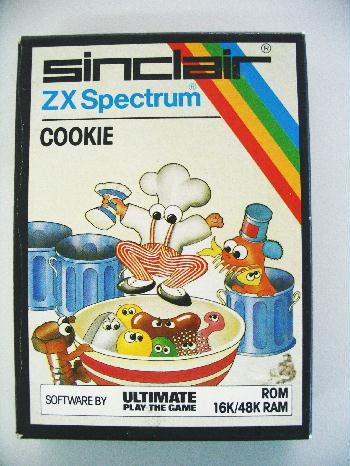

# Labtime - A continuation

## Contains
- A simple create-react-app setup with the brainJS utils pre-installed
- a simple Redux setup to separate UI from logic

## Install
Install the packages needed
```
npm install
``` 

## Run

Run with standard npm commands

``` 
npm start
```

## Training data
```training-data.js```  contains example of training data

## Next steps
1. Implement BrainJS so we can have a trained neural net that can decide between two things, the example data will train it to tell difference between a Trump tweet and a Kardashian tweet
2. Implement a feedback system, the brute force method of retraining can be used, either ditch old network and recreate with additional training data, or retrain old network with new data
3. Use the outputs of the previous setup to generate music with Magenta (we can walkthrough this step as its a bit complex)
    - VAE : this is a interpolator, it can either generate something new (interpolation between 0 and 1 with a single int as only required param), or if passed two tunes it can make a go between
    - RNN : this is a continuation model, given any tune, plus a temperature (variance between original and output), it will attempt to continue a previous piece of music
4. make sweet sweet music using your new ML tool!  Or go grab one of these: 
VAE interpolator : https://codepen.io/iansimon/full/Bxgbgz/
Latent-loops : https://teampieshop.github.io/latent-loops/
MelodyRNN : https://experiments.withgoogle.com/ai/ai-duet/view/

# Data Data and More Data
To learn things you need things to learn from, our various tasks will have a variety of inputs, and you can create models that can make music out of almost anything.  The ultimate goal of Labtime will be to make music with our models, but to do that, here we need sweet data!

Here are some ideas of where to find data!

## Midi
Most of the tools we have encountered that accept music directly as training data uses MIDI files

MIDI files : [Largest collection of midi files in the universe](https://www.reddit.com/r/datasets/comments/3akhxy/the_largest_midi_collection_on_the_internet/)

## History
Use Finna to find artifacts of Finnish history, be it poetry, images, war stories, or even bachelors theses (remember to filter by what is available online)

Finnish history : https://www.finna.fi/

## Images
Royalty free stock photos?  Yes please!

Images : https://www.freeimages.com/

## Other potential sources of data
### Nasa
Use NASAs apis as described in our our recruitment task!

NASA APIs : https://api.nasa.gov/

### Weather
Turn winter blues into actual blues

Weather APIs : https://openweathermap.org/api

### Twitter
Turn humanitys stream of conciousness into true beauty

Twitter : https://twitter.com

# For those that have read this far
Well done! Have cookie!



### Cheat links
Have some cheat links to preview some of things we might be doing on Friday:

Playground : https://playground.tensorflow.org

Magenta : https://magenta.tensorflow.org/

Tensorflow graphs : https://www.tensorflow.org/guide/graphs

MuseGAN : https://salu133445.github.io/musegan/

GAN : https://en.wikipedia.org/wiki/Generative_adversarial_network

RNN : https://en.wikipedia.org/wiki/Recurrent_neural_network

VAE : https://en.wikipedia.org/wiki/Autoencoder#Variational_autoencoder_(VAE) 
